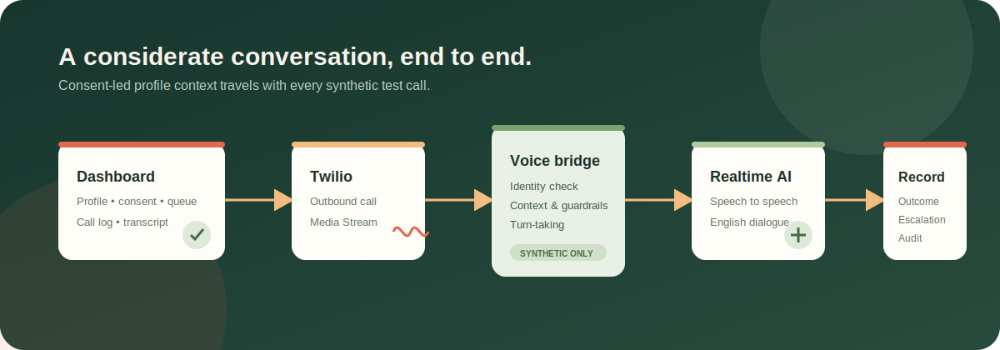

# DebtAssist

> A consent-aware, context-led voice outreach demo for synthetic repayment scenarios.

DebtAssist combines a React dashboard, FastAPI service, Twilio Media Streams, and OpenAI Realtime to demonstrate a respectful repayment-reminder conversation. It is designed for staff-owned, consented test numbers and synthetic data only.



## What it demonstrates

- Clean React/Vite operations dashboard with customer profiles, call records, transcripts, outcomes, and human-review flags.
- CSV validation for consented, eligible customer records.
- Synthetic profile context per customer: scenario, preferred contact style, and considerate next step.
- Twilio outbound calling through a bidirectional Media Stream.
- An English-speaking, context-aware voice agent that verifies identity before discussing the synthetic account.
- Conversational handling for payment commitments, callback requests, hardship, disputes, opt-outs, and human-agent requests.
- Audit events, call outcomes, engagement scoring, and escalation signals saved to the dashboard.

## Workflow

1. An operator reviews an eligible synthetic customer profile in the dashboard.
2. DebtAssist creates an outbound Twilio call.
3. Twilio connects a secure Media Stream to the FastAPI bridge.
4. The bridge creates a Realtime voice session with only that profile's synthetic context.
5. The agent greets, verifies identity, listens, and records a voluntary next step.
6. The dashboard receives the transcript, outcome, assessment, and any required escalation.

## Stack

| Layer | Technology |
| --- | --- |
| Dashboard | React + Vite |
| API | FastAPI + SQLAlchemy |
| Local storage | SQLite |
| Telephony | Twilio Voice + Media Streams |
| Voice intelligence | OpenAI Realtime API |
| Tunnel for local testing | ngrok |

## Run locally

### 1. Install dependencies

```powershell
py -m venv .venv
.\.venv\Scripts\Activate.ps1
pip install -r requirements.txt
npm install
```

### 2. Start the API

```powershell
py -m uvicorn app.main:app --host 0.0.0.0 --port 8000
```

### 3. Start the dashboard

```powershell
npm run dev
```

Open [http://127.0.0.1:5173](http://127.0.0.1:5173). The API health endpoint is available at [http://127.0.0.1:8000/health](http://127.0.0.1:8000/health).

## Synthetic data

The repository includes `synthetic_defaulters.csv`, containing fictional customer profiles. Every record is intended only for controlled testing. Import it through the dashboard or use the upload API.

Required CSV columns:

```text
borrower_id, borrower_name, phone_number, loan_account_id, emi_amount,
days_past_due, consent_to_contact, permitted_to_call
```

## Live voice-demo setup

Create a local `.env` file. It is intentionally ignored by Git.

```dotenv
VOICE_PROVIDER=twilio
LIVE_CALLS_ENABLED=true
LIVE_AI_VOICE_ENABLED=true

PUBLIC_BASE_URL=https://your-public-ngrok-domain
TWILIO_ACCOUNT_SID=...
TWILIO_AUTH_TOKEN=...
TWILIO_FROM_NUMBER=+1...

OPENAI_API_KEY=...
OPENAI_REALTIME_MODEL=gpt-realtime
ORGANISATION_NAME=DebtAssist Demo
```

Expose the API before placing a call:

```powershell
ngrok http 8000
```

Use only a staff-owned, consented test number. Twilio trial accounts may play a trial announcement before the agent starts speaking.

## Conversation guardrails

The voice agent is deliberately constrained:

- Verifies identity before disclosing synthetic account details.
- Uses the profile context as a gentle cue, never as an assertion about the caller.
- Does not request payment credentials, take payments, negotiate terms, threaten, or make legal claims.
- Stops repayment discussion for hardship, disputes, opt-outs, distress, abusive language, or a human-agent request.
- Clarifies ambiguous dates and times rather than guessing.

## Useful commands

```powershell
# Run backend checks
py -m pytest -q
py -m ruff check app

# Build the dashboard
npm run build

# Run development dashboard
npm run dev
```

## Project structure

```text
app/
  main.py          FastAPI routes and webhook handlers
  realtime.py      Twilio ↔ OpenAI Realtime voice bridge
  telephony.py     Twilio provider adapter
  demo_context.py  Synthetic profile context
src/
  main.jsx         React dashboard
  *.css            Dashboard styling
docs/
  workflow.svg     Architecture/workflow visual
```

## Production note

This is a controlled demonstration, not a production collections platform. Production deployment requires approved compliance policies, calling-window and frequency controls, authentication/RBAC, managed secrets, durable storage, legal review, and a staffed human escalation process.
